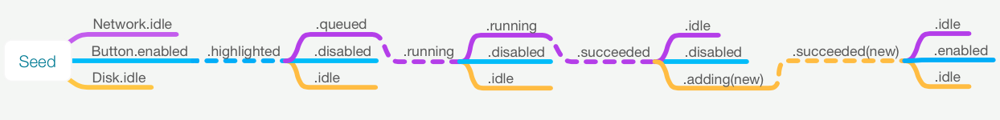
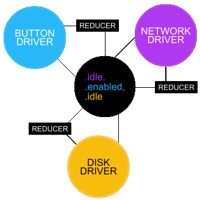

# Cycle.swift

[](http://cocoapods.org/pods/Cycle)
[](http://cocoapods.org/pods/Cycle)
[](http://cocoapods.org/pods/Cycle)
[](https://github.com/Carthage/Carthage)

## Overview
Cycle provides a means of writing an application as a function that reduces a stream of events to a stream of effects. The stream of effects can be thought of as a reel of film that can be fed to hardware to be projected. The approach allows for consistant execution and greater observability-of/control-over state. [CycleMonitor](https://github.com/BrianSemiglia/CycleMonitor) is a companion development tool that can be used to achieve that observability and control over your application.

### Anatomy
Label | Purpose
----- | -------
Frame | A struct representing the state of the entire application at a given moment  
Frame Filter | A function that converts frames to driver-specific models that have been stripped of redundancies  
Driver | An isolated, stateless object that renders frames to hardware and deliver events  
Event | A driver-specific enum expressing events experienced by drivers  
Event Filter | A function that produces frames based on an input event

### Composition
1. `Frames` arrive as inputs to the main function.
2. `Frames` are routed to frame-filter functions that produce models specific to `Drivers`.
3. `Models` are fed to each `Driver` to be rendered to hardware.
4. `Drivers` deliver `Events` as they arrive.
5. The `Event` along with the previous _n_ `Frames` are fed to a event-filter to produce a new `Frame`.
6. The new `Frame` is input to another execution of the main function and a cycle is produced.

```
frame ---------> driver ----------> event + previous frames --> new frame
         
Network.Model -> Network                    Network.Model       Network.Model
Screen.Model  -> Screen  -> Network.Event + Screen.Model   ---> Screen.Model
Session.Model -> Session                    Session.Model       Session.Model
```

### Concept
The goal is to produce an application that has clear and uniform boundaries between the declarative and procedural. The declarative side can be understood as a timeline of `Frames` based on the incoming timeline of `Events` which when intertwined can be visualized as such:



The procedural rendering of those timelines can be visualized like so:



[View as higher-res SVG](https://briansemiglia.github.io/cycled_drivers_reduced.svg)

## Anatomy In-Depth
### Frame
The `Frame` is simply a struct representing the state of application at a given moment. Its value can store anything that you might expect objects to normally maintain such as view-sizes/positions/colors, navigation-traversal, item-selections, etc. Ideally, the storage of values that can be derived from other values should be avoided. If performance is a concern, the output of event/frame-filters can be [memoized](https://github.com/BrianSemiglia/RxCacheMap).
  
### Frame-Filter
A frame-filter function allows for applying changes to a received Frame before being rendered. There are two common filters:
  
- A conversion from your application-specific model to a driver-specific one. This design prevents a dependency of any particular driver to any particular global domain and is basically an application of the [Dependency Inversion Principle](https://en.wikipedia.org/wiki/Dependency_inversion_principle).  

- An equality check to prevent unnecessary renderings. If a desired frame has already been rendered, a model can be created with some sort of no-op value instead. In order to access the previous _n_ frames for this equality check, the `scan` Rx operator can be used. It would also make sense that `Drivers` be the providers of this sort of filter as the implementation of the filter would depend of the `private` implementation of the `Driver`. Either way, this sort of filter would provide a deterministic function for `Driver` state management.

### Driver
Drivers are stateless objects that simply receive a value, render it to hardware and output `Event` values as they are experienced by hardware. They ideally have one public function `eventsCapturedAfterRendering(model: RxSwift.Observable<Driver.Model>) -> RxSwift.Observable<Driver.Event>` (aside from an `init` function). They also ideally have no concept of what is beyond their interface, avoiding references to global singletons/types and having a model that they have autonomy over; this would be another application of the [Dependency Inversion Principle](https://en.wikipedia.org/wiki/Dependency_inversion_principle).

### Event
Events are simple enum values that may also contain associated values received by hardware. Events are ideally defined and owned by a `Driver` as opposed to being defined at the application level ([Dependency Inversion](https://en.wikipedia.org/wiki/Dependency_inversion_principle)).

### Event-Filter
An event-filter function allows for the creation of a new `Frame` based on an incoming `Event` and the previous `Frames`. The use of the Rx `withLatestFrom` can be used to access the first previous frame. The use of the Rx `scan` operator can also be used to reach `Frames`further back in time should they be necessary. This is useful for determinations that require a larger context. For example, a touch-gesture could be recognized by examining the last _n_ number of touch-coordinates. 

## Reasoning

### Doing One Thing Well
It's said that good code does one thing well but what is 'doing' and what is a 'thing'? Verifying that something is being done can be achieved by observing a change so it might be fair to say that 'doing' is 'changing'. A change requires a before and an after so a 'thing' might be defined as a type of value that can vary and that can be compared. Putting it altogether, a revised definition might read 'Good code defines a single, verifiable transformation'. Functional programming embraces this philosphy by prioritizing types and visibility. Pure functions take one value, produce a new value and return it without making any invisible changes (side-effects). Cycle attempts to make an application a single, verifiable transformation of `Events` to `Frames`.

An exception to this within Cycle is the use of RxSwift. RxSwift isn't completely functional as it allows creating points of persistent state within streams (a side-effect that can affect subsequent executions) but it leans heavily toward dealing in terms of value and visibility.

### Change without Change
A transformation is the goal, however functional programming also discourages mutability. How can something change without changing? Cycle attempts to answer that question with a flip-book like model. Just as every frame of a movie is unchanging, so can be view-models. Change is only produced once a frame is fed into a projector and run past light, or rendered rather. In the same way, Cycle provides the scaffolding necessary to feed an infinite list of view-models into a thin layer of drivers to be procedurally rendered.

### Truth
Objects typically maintain their own version of the truth. This has the potential to lead to many truths, sometimes conflicting. These conflicts can cause stale/incorrect data to persist. A single source of truth provides consistency for all. At the same time, moving state out of objects removes their identity and makes them much more reusable/disposable. For example, a view that is not visible can be freed/reused without losing the data that it was hosting.

### Perspective
Going back to the flip-book philosophy, more complex animations also include the use of sound. Light and sound are two perspectives rendered in unison to create the illusion of physical cohesion. The illusion is due to the mediums having no physical dependence on one another. In the Cycle architecture, drivers are the perspectives of the application's state.

Further, perspectives don't have to be specific to a single medium. For example, a screen implemented as a nested-tree of views could be instead be implemented as an array of independent views backed by a nested-model. This would prevent changes to a child-view's interface from rippling up to its parents, grandparents, etc. while still allowing for a coordinated rendering. Scaled up, this has the potential to produce an application where there is only ever one degree of delegation.

### Self-Centered Perspective
Just as paper and celluloid aren't exclusive to the purpose of movies, drivers are independent of an application’s intentions. Drivers set the terms of their contract (view-model) and the events they output. Changes to an application's model don’t break its drivers' design. Changes to its drivers' design do break the application's design. This produces modularity amongst drivers.

### Commands as Values
Frames in an animation are easy to understand as values, but they can also be understood as commands for the projector at a given moment. By storing commands as values, they can be used as you might values (verified, reversed, throttled, filtered, spliced, and replayed); all of which make for useful [development tools](https://github.com/BrianSemiglia/CycleMonitor).


### Live Broadcast
The flip-book model breaks a bit when it comes to the uncertain future of an application’s timeline. Each frame of an animation is usually known before playback but because drivers provide a finite set of possible events, that uncertainty can be constrained and given the means to produce the next frame for every action.

## Implementation

#### MutableLens
A `MutableLens` houses a `Driver` and the transformations necessary to inject the latest data `Frame -> Driver` and reconsile the latest events `Driver -> Event + Frame -> NewFrame`.
```swift
MutatingLens<Observable<Global.State>, Driver>(
    get: { (states: Observable<Global.State>) -> Driver in
        Driver().rendering(
            model: states.map(
              globalStateToDriverModel // Frame-Filter
            )
        )
    },
    set: { driver, states -> Observable<Global.State> in
        driver
            .events()
            .tupledWithLatestFrom(states)
            .map(
              driverEventToGlobalState // Event-Filter
            )
    }
)
```

#### CycledLens
`CycledLens` subscribes a lens' output to its input allowing it to render changes produces by its events. By providing a common interface, `MutableLenses` can be composed using the `zip` operator. Zipping produces a single `MutableLens` that provides each of its internal lenses with latest output of themselves and their sibling `Lenses`.

```swift
CycledLens<Driver, Global.State>(
    lens: { (source: Observable<Global.State>) in
        MutatingLens.zip(
            source.networkLens(),
            source.persistenceLens(),
            source.screenLens(),
            source.audioLens()
        )
    }
)
```
  
#### Driver
Drivers render a stream of effect-models and produce a stream of event-models.
  ```swift
  final class MyDriver {

    struct Model {
      var state: State
      enum State {
        case idle
        case sending
      }
    }
    
    enum Event {
      case receiving
    }

    let output: Observable<Event>
    private let input: Observable<Model>
    private let cleanup = DisposeBag()
    
    init(initial: Model, subsequent: Observable<Model>) {
      subsequent
        .startWith(initial)
        .bind(to: self.render)
        .disposed(by: cleanup)
    }

    private func render(model: Model) {    
        // Perform side-effects...
    }

    private func didReceiveEvent() {
      output.on(.next(.receiving))
    }

  }
  ```

A sample project of the infamous 'Counter' app is included.

## Animations

In most scenarios, an event will produce a single frame  `Event -> Frame`. However, animated responses have a transformation signature of `Event -> [Frame]`. This can be handled by feeding the `[Frame]` into a sampled stream which then outputs an `[Frame]` every _n_ seconds based on the desired frame-rate. That `Frame` array can then be fed to a frame-filter which strips out all but the first frame before being deliver to the drivers. The remaining frames are sent back into the stream to be rendered on the next pass. The following code provides an implementation of this:

  ```swift
  CycledLens<View, [Global.State]>(
    lens: { (source: Observable<[Global.State]>) in
        MutatingLens.zip(
            source.lens(
                get: { state -> View in
                    // Renders first frame of animation.
                    View().rendering(
                        model: state
                            .compactMap { $0.head }
                            .map(globalStateToViewModel)
                    )
                },
                set: { view, state in
                    // Produces animation of [Global.Frame].
                    view
                        .events()
                        .tupledWithLatestFrom(state)
                        .map(animatedState)
                }
            ),
            // Sends remaining animation to lenses after delay
            source.emittingTail(every: .milliseconds(1000 / 60))
        )
    }
  )
  ```

By sending the rest of the anticipated `Frames` back into the stream, your application has the option of re-evaluating animations based on new events during playback. Animations can thus be removed, suspended, or changed in mid-flight. The following pseudo `Event -> [Frame]` timelines are examples of ways that animations can be altered as they progress:

  ```
  // Intercepted
  .animateTo(5) -> [1, 2, 3, 4, 5]
  .tick         -> [2, 3, 4, 5]
  .animateTo(0) -> [2, 1, 0]
  .tick         -> [1, 0]
  .animateTo(4) -> [1, 2, 3, 4]
  .tick         -> [2, 3, 4]
  .tick         -> [3, 4]
  .tick         -> [4]

  // Appended
  .animateTo(3) -> [0, 1, 2, 3]
  .tick         -> [1, 2, 3]
  .animateTo(0) -> [1, 2, 3, 2, 1, 0]
  .tick         -> [2, 3, 2, 1, 0]
  .animateTo(3) -> [2, 3, 2, 1, 0, 1, 2, 3]
  .tick         -> [3, 2, 1, 0, 1, 2, 3]
  .tick         -> [2, 1, 0, 1, 2, 3]
  .tick         -> [1, 0, 1, 2, 3]
  .tick         -> [0, 1, 2, 3]
  .tick         -> [1, 2, 3]
  .tick         -> [2, 3]
  .tick         -> [3]

  // Removed
  .animateTo(4) -> [0, 1, 2, 3, 4]
  .tick         -> [1, 2, 3, 4]
  .cancel       -> [1]
  ```

The included sample application `Integer Mutation Animated` provides a working demonstration of this.

## Related Material
- [Boundaries by Gary Bernhardt](https://www.youtube.com/watch?v=yTkzNHF6rMs)
- [Cycle.js](https://cycle.js.org)
- [Unidirectional data flow architectures, Andre Staltz - AtTheFrontend 2016](https://www.youtube.com/watch?v=1c6XiQsnh_U)
- [Unidirectional User Interface Architectures - Andre Staltz](https://staltz.com/unidirectional-user-interface-architectures.html)
- [Redux](http://redux.js.org), [ReSwift](https://github.com/ReSwift/ReSwift)
- [Elm Architecture](https://guide.elm-lang.org/architecture/)
- [Turing Machine](https://en.wikipedia.org/wiki/Turing_machine)

## Requirements
iOS 9+

## Sample Apps

To run the sample apps, you'll need to build their dependencies. You can do so by opening Terminal and running `carthage bootstrap`.

## Installation

Cycle is available via [CocoaPods](http://cocoapods.org) or [Carthage](https://github.com/Carthage/Carthage).
To install via Cocoapods, add the following line to your Podfile:

```ruby
pod "Cycle"
```

## License
Cycle is available under the MIT license. See the LICENSE file for more info.
